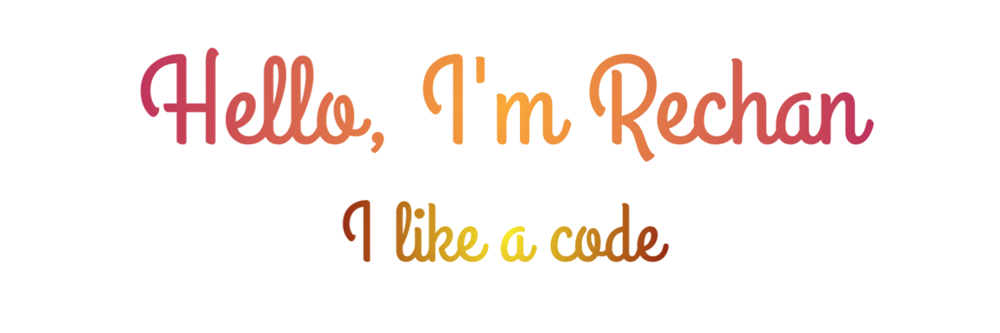

# 

Welcome to my corner of GitHub! I'm <strong>rechan dinata</strong>, a programmer who treats coding like playing with Lego blocks—assembling, tweaking, and occasionally vacuuming up those pesky bugs. If I'm not in front of my computer, I’m probably hunting for coffee ☕ or reveling in the beauty of algebra. 📐

## 🛠️ My Skills 🚀

- **Frameworks & Tools:**
  - **Laravel:** Master of creating web apps that look like magic! With Laravel, I can make CRUD operations cooler than extra-topping pizza. 🍕✨
  - **SDL2:** Building engaging projects, though you might not find me deep in game development—my focus is on exploring new tech and solutions. 🎮🔍
  - **QSack:** Still in the “wow, this is cool!” and “what else can I do with this?” phase—exploring the QSack universe like a digital detective! 🕵️‍♂️🌟
 
  

## 🌱 Currently Learning 📚

- **Cryptography:** Turning messages into secret codes like a character from a spy thriller, but without the real-life drama. 🔐🕵️‍♂️
- **IoT (Internet of Things):** Diving into the world of smart devices and interconnected systems, where innovation meets everyday life. 🌐🔧

## 🤔 Fun Facts 😄

- **Naps:** I usually avoid napping due to the bitter tongue and dizzy head experience—apparently, that’s just how naps work. 😴❌
- **Hobbies:** Diving into graphics and solving algebra puzzles while chuckling to myself. Solving problems is my jam—unless the problems are too stubborn! 📈🎨

## 📫 Get in Touch 💬

- **Email:** [hoshikochan93@gmail.com](mailto:hoshikochan93@gmail.com) – Drop me an email if you have questions or just want to share a funny coding meme. 📬
- **LinkedIn:** [rechan Dinata](https://www.linkedin.com/in/rechan-dinata-a80552278/) – Let’s connect! We can swap knowledge, memes, or coffee recipes! 🌐
- **Whatsapp:** [@ㅤㅤㅤㅤㅤㅤecan](https://wa.me/62895422689930) – Follow me for random updates, amusing code quotes, and maybe a few programming jokes! 🐦

Thanks for stopping by my profile! I hope your day is as bright as my computer screen and as sweet as a cup of coffee! 🚀💻
