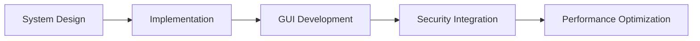

  # 💻 Rechan Dinata | 

<div align="center">
  
</div>

---

## 👤 Profile

> *"Working on easy to use desktop interfaces. Interested in applying cryptography and GUI design to build secure and easy to use applications."*

<div align="center">
  
  
  
</div>

---

## 🛠️ Technical Expertise

### Core Technologies
<div align="center">
  
  
  
  
  
</div>

### Security & Cryptography
<div align="center">
  
  
  
  
</div>

### Development Tools
<div align="center">
  
  
  
</div>

### IoT & Embedded
<div align="center">
  
<!--    -->
  
</div>

---

## 📊 Development Activity


<table align="center"> <tr> <td width="50%">  </td> <td width="50%">  </td> </tr> <tr> <td colspan="2">  </td> </tr> </table>
🔭 Current Projects
Featured Work
<table align="center"> <tr> <th>Project</th> <th>Description</th> <th>Technologies</th> </tr> <tr> <td><a href="https://zreechxnn.github.io/maze-game/">🧩 Maze Game</a></td> <td>Pathfinding visualization with procedural generation</td> <td>C++, SDL, OpenGL</td> </tr> <tr> <td><a href="https://zreechxnn.github.io/calculator-SDL2/">🧮 Scientific Calculator</a></td> <td>Advanced calculator with graphing capabilities</td> <td>C++, SDL, Custom Math Parser</td> </tr> <tr> <td>🔐 CryptoVault</td> <td>File encryption suite with military-grade security</td> <td>C++, OpenSSL, AES-256</td> </tr> </table>

---

<div align="center"> <a href="mailto:hoshikochan93@gmail.com">  </a> <a href="https://www.linkedin.com/in/rechan-dinata-a80552278">  </a> <a href="https://github.com/Zreechxnn">  </a> </div><div align="center" style="margin-top:30px">
<div align="center">
  <picture>
    <source media="(prefers-color-scheme: dark)" srcset="https://raw.githubusercontent.com/zreechxnn/output/output/snake-dark.svg" />
    <source media="(prefers-color-scheme: light)" srcset="https://raw.githubusercontent.com/zreechxnn/output/snake.svg" />
    
  </picture>
</div>
 </div><div align="center" style="margin-top:20px; font-size:0.9em; color:#4F8CC9"> <i>"Crafting performant systems beyond conventional boundaries"</i> • <i>"Secure by design, efficient by implementation"</i> </div> 
```
